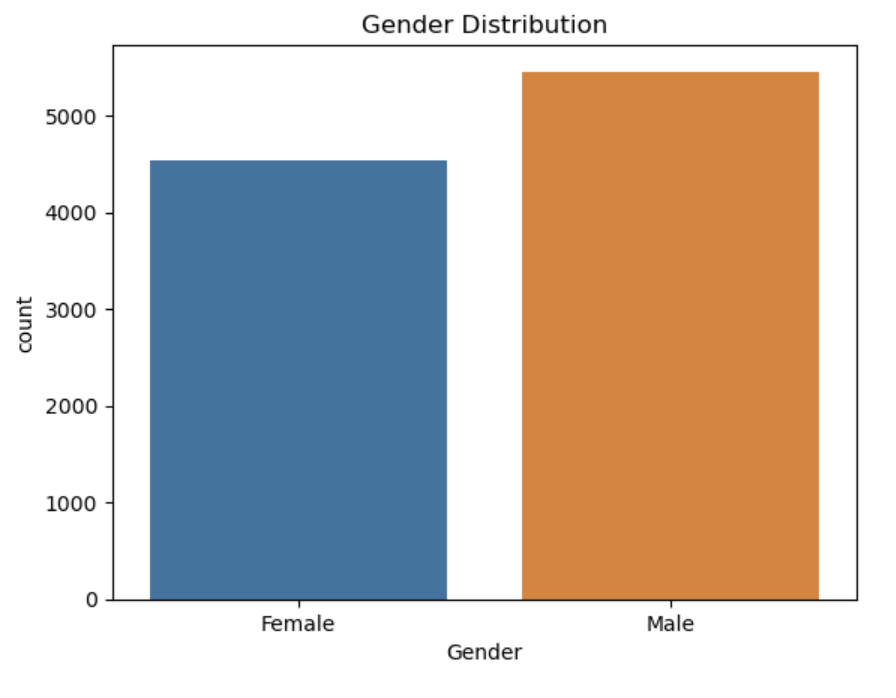
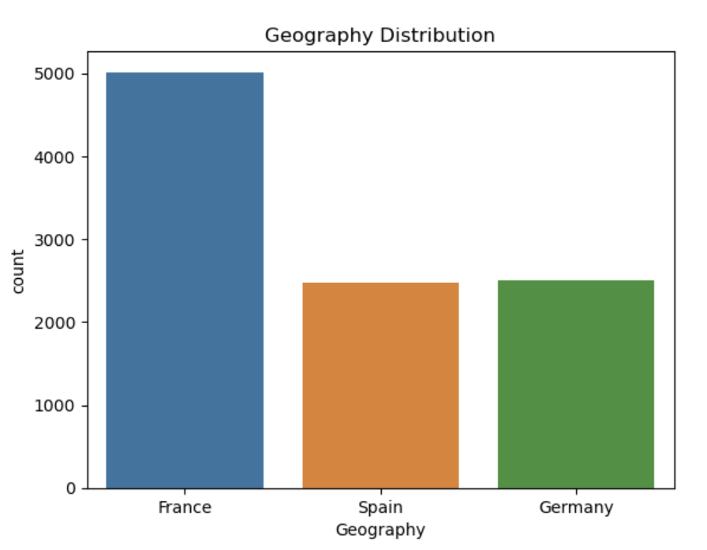
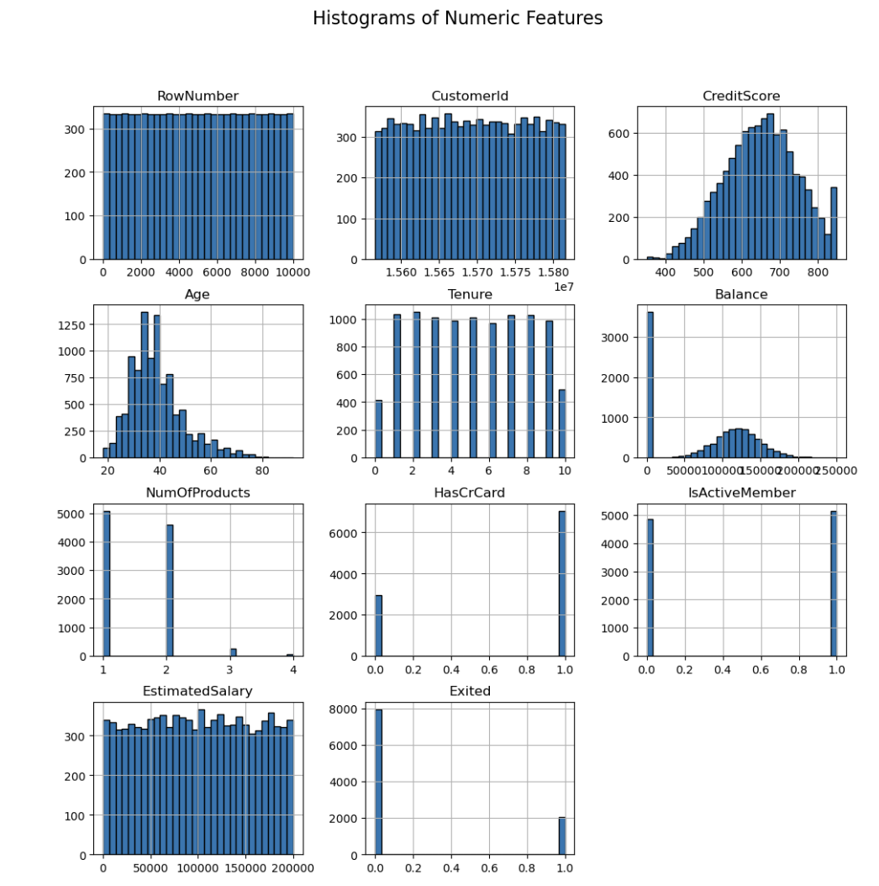
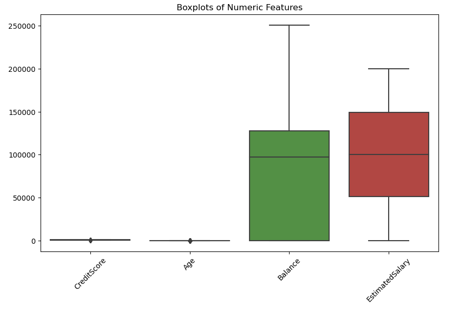
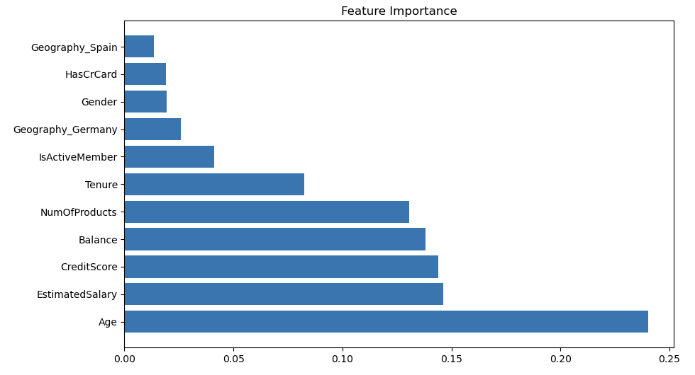

# 🧠 Customer Churn Prediction Using Machine Learning

**Prepared by:** Mahima Advilkar  
**Role:** Data Analyst  
**Domain:** Predictive Modeling | Banking Analytics  
**Tools Used:** Python, scikit-learn, pandas, seaborn, matplotlib

---

## 📌 Project Objective

This project focuses on predicting customer churn in a banking environment using supervised machine learning. By identifying key churn drivers, the model helps banks take action to retain valuable customers.

---

## 📂 Dataset Overview

- **Source:** Synthetic banking data from a European bank  
- **Records:** 10,000  
- **Target Variable:** `Exited` (1 = churned, 0 = retained)  

### Features:
- **Demographics**: Geography, Gender, Age  
- **Behavior**: CreditScore, Tenure, Balance, NumOfProducts, HasCrCard, IsActiveMember  
- **Financials**: EstimatedSalary

---

## 🔍 Exploratory Data Analysis (EDA)

- Churn rate ≈ 20%  
- Older, inactive customers are more likely to churn  
- High balance without engagement is a churn signal  
- German customers showed higher churn

### 📊 Visuals:

#### 🔹 Churn Distribution  

.png)

#### 🔹 Gender Distribution  

#### 🔹 Geography Distribution  

#### 🔹 Histograms of Numeric Features  

#### 🔹 Outlier Detection (Boxplot)  

---

## 🛠 Feature Engineering & Preprocessing

- Label Encoding: `Gender`  
- One-Hot Encoding: `Geography`, `AgeGroup`, `TenureGroup`  
- Engineered Features:  
  - `BalanceZero`  
  - `BalanceToSalaryRatio`  
  - `ProductUsage`  
  - `Male_Germany`, `Male_Spain`
- StandardScaler applied to numeric features

![Feature Engineered] (images/Engineered Features.png)
---

## 🤖 Models Trained

| Model                  | Accuracy |
|------------------------|----------|
| Gradient Boosting      | 86.45%   |
| Random Forest          | 86.25%   |
| Logistic Regression    | 80.45%   |
| K-Nearest Neighbors    | 79.85%   |
| SVM (Linear Kernel)    | 79.60%   |

### 📈 Evaluation Metrics:
- Accuracy
- Precision
- Recall
- F1-Score
- Confusion Matrix

#### 🔹 Confusion Matrix  
![Confusion Matrix]

---

## 🔍 Feature Importance

Feature importance was evaluated using the Random Forest model.
![RandomForest Model] (images/Random Forest Classifier.png)

Top predictors:
- Age  
- EstimatedSalary  
- CreditScore  
- Balance  
- NumOfProducts  
- IsActiveMember  
- Tenure

---

## 💡 Business Recommendations

- Focus retention efforts on older, inactive customers  
- Launch personalized engagement campaigns  
- Encourage multi-product usage  
- Monitor inactivity and trigger alerts

---

## 🚀 Deployment Plan

- Weekly churn prediction dashboard  
- CRM integration for churn scoring  
- Real-time scoring API using Flask  
- Retrain model quarterly or based on performance drift

---

## 🛠 Next Steps

- Use GridSearchCV for hyperparameter tuning  
- Apply SMOTE/class weights for better recall  
- Wrap the model in a Flask/FastAPI service  
- Monitor performance and retrain periodically

---

## 📁 Files in This Repository

- `Customer_Churn_Prediction.ipynb` – Python code  
- `Churn_Modelling.csv` – Raw dataset  
- `Customer_Churn_Report.pdf` – Final project report  
- `/images/` – All visualizations (graphs used in README)

---

⭐ *If you liked this project, feel free to fork, star, or connect!*  
